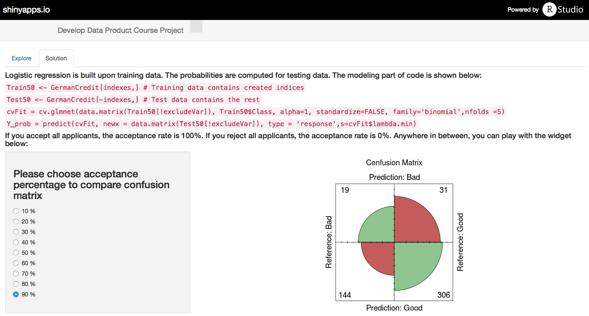

<!-- Limit image width and height -->
<style type='text/css'>
img {
    max-height: 400px;
    max-width: 700px;
}
</style>

## The Context

* When a bank receives a loan application, based on the applicant’s profile the bank has to make a decision regarding whether to go ahead with the loan approval or not. Based on history records, there are two types of customers:
    + Good applicant: pay on time and do not charge off
    + Bad applicant: do not pay on time and/or charge off
* The German Credit data set used comes from [UCI Machine Learning Repository](https://archive.ics.uci.edu/ml/machine-learning-databases/statlog/german/)


```r
library(caret)
data(GermanCredit)
summary(GermanCredit)
```

```
##     Duration        Amount      InstallmentRatePercentage
##  Min.   : 4.0   Min.   :  250   Min.   :1.000            
##  1st Qu.:12.0   1st Qu.: 1366   1st Qu.:2.000            
##  Median :18.0   Median : 2320   Median :3.000            
##  Mean   :20.9   Mean   : 3271   Mean   :2.973            
##  3rd Qu.:24.0   3rd Qu.: 3972   3rd Qu.:4.000            
##  Max.   :72.0   Max.   :18424   Max.   :4.000            
##  ResidenceDuration      Age        NumberExistingCredits
##  Min.   :1.000     Min.   :19.00   Min.   :1.000        
##  1st Qu.:2.000     1st Qu.:27.00   1st Qu.:1.000        
##  Median :3.000     Median :33.00   Median :1.000        
##  Mean   :2.845     Mean   :35.55   Mean   :1.407        
##  3rd Qu.:4.000     3rd Qu.:42.00   3rd Qu.:2.000        
##  Max.   :4.000     Max.   :75.00   Max.   :4.000        
##  NumberPeopleMaintenance   Telephone     ForeignWorker    Class    
##  Min.   :1.000           Min.   :0.000   Min.   :0.000   Bad :300  
##  1st Qu.:1.000           1st Qu.:0.000   1st Qu.:1.000   Good:700  
##  Median :1.000           Median :1.000   Median :1.000             
##  Mean   :1.155           Mean   :0.596   Mean   :0.963             
##  3rd Qu.:1.000           3rd Qu.:1.000   3rd Qu.:1.000             
##  Max.   :2.000           Max.   :1.000   Max.   :1.000             
##  CheckingAccountStatus.lt.0 CheckingAccountStatus.0.to.200
##  Min.   :0.000              Min.   :0.000                 
##  1st Qu.:0.000              1st Qu.:0.000                 
##  Median :0.000              Median :0.000                 
##  Mean   :0.274              Mean   :0.269                 
##  3rd Qu.:1.000              3rd Qu.:1.000                 
##  Max.   :1.000              Max.   :1.000                 
##  CheckingAccountStatus.gt.200 CheckingAccountStatus.none
##  Min.   :0.000                Min.   :0.000             
##  1st Qu.:0.000                1st Qu.:0.000             
##  Median :0.000                Median :0.000             
##  Mean   :0.063                Mean   :0.394             
##  3rd Qu.:0.000                3rd Qu.:1.000             
##  Max.   :1.000                Max.   :1.000             
##  CreditHistory.NoCredit.AllPaid CreditHistory.ThisBank.AllPaid
##  Min.   :0.00                   Min.   :0.000                 
##  1st Qu.:0.00                   1st Qu.:0.000                 
##  Median :0.00                   Median :0.000                 
##  Mean   :0.04                   Mean   :0.049                 
##  3rd Qu.:0.00                   3rd Qu.:0.000                 
##  Max.   :1.00                   Max.   :1.000                 
##  CreditHistory.PaidDuly CreditHistory.Delay CreditHistory.Critical
##  Min.   :0.00           Min.   :0.000       Min.   :0.000         
##  1st Qu.:0.00           1st Qu.:0.000       1st Qu.:0.000         
##  Median :1.00           Median :0.000       Median :0.000         
##  Mean   :0.53           Mean   :0.088       Mean   :0.293         
##  3rd Qu.:1.00           3rd Qu.:0.000       3rd Qu.:1.000         
##  Max.   :1.00           Max.   :1.000       Max.   :1.000         
##  Purpose.NewCar  Purpose.UsedCar Purpose.Furniture.Equipment
##  Min.   :0.000   Min.   :0.000   Min.   :0.000              
##  1st Qu.:0.000   1st Qu.:0.000   1st Qu.:0.000              
##  Median :0.000   Median :0.000   Median :0.000              
##  Mean   :0.234   Mean   :0.103   Mean   :0.181              
##  3rd Qu.:0.000   3rd Qu.:0.000   3rd Qu.:0.000              
##  Max.   :1.000   Max.   :1.000   Max.   :1.000              
##  Purpose.Radio.Television Purpose.DomesticAppliance Purpose.Repairs
##  Min.   :0.00             Min.   :0.000             Min.   :0.000  
##  1st Qu.:0.00             1st Qu.:0.000             1st Qu.:0.000  
##  Median :0.00             Median :0.000             Median :0.000  
##  Mean   :0.28             Mean   :0.012             Mean   :0.022  
##  3rd Qu.:1.00             3rd Qu.:0.000             3rd Qu.:0.000  
##  Max.   :1.00             Max.   :1.000             Max.   :1.000  
##  Purpose.Education Purpose.Vacation Purpose.Retraining Purpose.Business
##  Min.   :0.00      Min.   :0        Min.   :0.000      Min.   :0.000   
##  1st Qu.:0.00      1st Qu.:0        1st Qu.:0.000      1st Qu.:0.000   
##  Median :0.00      Median :0        Median :0.000      Median :0.000   
##  Mean   :0.05      Mean   :0        Mean   :0.009      Mean   :0.097   
##  3rd Qu.:0.00      3rd Qu.:0        3rd Qu.:0.000      3rd Qu.:0.000   
##  Max.   :1.00      Max.   :0        Max.   :1.000      Max.   :1.000   
##  Purpose.Other   SavingsAccountBonds.lt.100 SavingsAccountBonds.100.to.500
##  Min.   :0.000   Min.   :0.000              Min.   :0.000                 
##  1st Qu.:0.000   1st Qu.:0.000              1st Qu.:0.000                 
##  Median :0.000   Median :1.000              Median :0.000                 
##  Mean   :0.012   Mean   :0.603              Mean   :0.103                 
##  3rd Qu.:0.000   3rd Qu.:1.000              3rd Qu.:0.000                 
##  Max.   :1.000   Max.   :1.000              Max.   :1.000                 
##  SavingsAccountBonds.500.to.1000 SavingsAccountBonds.gt.1000
##  Min.   :0.000                   Min.   :0.000              
##  1st Qu.:0.000                   1st Qu.:0.000              
##  Median :0.000                   Median :0.000              
##  Mean   :0.063                   Mean   :0.048              
##  3rd Qu.:0.000                   3rd Qu.:0.000              
##  Max.   :1.000                   Max.   :1.000              
##  SavingsAccountBonds.Unknown EmploymentDuration.lt.1
##  Min.   :0.000               Min.   :0.000          
##  1st Qu.:0.000               1st Qu.:0.000          
##  Median :0.000               Median :0.000          
##  Mean   :0.183               Mean   :0.172          
##  3rd Qu.:0.000               3rd Qu.:0.000          
##  Max.   :1.000               Max.   :1.000          
##  EmploymentDuration.1.to.4 EmploymentDuration.4.to.7
##  Min.   :0.000             Min.   :0.000            
##  1st Qu.:0.000             1st Qu.:0.000            
##  Median :0.000             Median :0.000            
##  Mean   :0.339             Mean   :0.174            
##  3rd Qu.:1.000             3rd Qu.:0.000            
##  Max.   :1.000             Max.   :1.000            
##  EmploymentDuration.gt.7 EmploymentDuration.Unemployed
##  Min.   :0.000           Min.   :0.000                
##  1st Qu.:0.000           1st Qu.:0.000                
##  Median :0.000           Median :0.000                
##  Mean   :0.253           Mean   :0.062                
##  3rd Qu.:1.000           3rd Qu.:0.000                
##  Max.   :1.000           Max.   :1.000                
##  Personal.Male.Divorced.Seperated Personal.Female.NotSingle
##  Min.   :0.00                     Min.   :0.00             
##  1st Qu.:0.00                     1st Qu.:0.00             
##  Median :0.00                     Median :0.00             
##  Mean   :0.05                     Mean   :0.31             
##  3rd Qu.:0.00                     3rd Qu.:1.00             
##  Max.   :1.00                     Max.   :1.00             
##  Personal.Male.Single Personal.Male.Married.Widowed Personal.Female.Single
##  Min.   :0.000        Min.   :0.000                 Min.   :0             
##  1st Qu.:0.000        1st Qu.:0.000                 1st Qu.:0             
##  Median :1.000        Median :0.000                 Median :0             
##  Mean   :0.548        Mean   :0.092                 Mean   :0             
##  3rd Qu.:1.000        3rd Qu.:0.000                 3rd Qu.:0             
##  Max.   :1.000        Max.   :1.000                 Max.   :0             
##  OtherDebtorsGuarantors.None OtherDebtorsGuarantors.CoApplicant
##  Min.   :0.000               Min.   :0.000                     
##  1st Qu.:1.000               1st Qu.:0.000                     
##  Median :1.000               Median :0.000                     
##  Mean   :0.907               Mean   :0.041                     
##  3rd Qu.:1.000               3rd Qu.:0.000                     
##  Max.   :1.000               Max.   :1.000                     
##  OtherDebtorsGuarantors.Guarantor Property.RealEstate Property.Insurance
##  Min.   :0.000                    Min.   :0.000       Min.   :0.000     
##  1st Qu.:0.000                    1st Qu.:0.000       1st Qu.:0.000     
##  Median :0.000                    Median :0.000       Median :0.000     
##  Mean   :0.052                    Mean   :0.282       Mean   :0.232     
##  3rd Qu.:0.000                    3rd Qu.:1.000       3rd Qu.:0.000     
##  Max.   :1.000                    Max.   :1.000       Max.   :1.000     
##  Property.CarOther Property.Unknown OtherInstallmentPlans.Bank
##  Min.   :0.000     Min.   :0.000    Min.   :0.000             
##  1st Qu.:0.000     1st Qu.:0.000    1st Qu.:0.000             
##  Median :0.000     Median :0.000    Median :0.000             
##  Mean   :0.332     Mean   :0.154    Mean   :0.139             
##  3rd Qu.:1.000     3rd Qu.:0.000    3rd Qu.:0.000             
##  Max.   :1.000     Max.   :1.000    Max.   :1.000             
##  OtherInstallmentPlans.Stores OtherInstallmentPlans.None  Housing.Rent  
##  Min.   :0.000                Min.   :0.000              Min.   :0.000  
##  1st Qu.:0.000                1st Qu.:1.000              1st Qu.:0.000  
##  Median :0.000                Median :1.000              Median :0.000  
##  Mean   :0.047                Mean   :0.814              Mean   :0.179  
##  3rd Qu.:0.000                3rd Qu.:1.000              3rd Qu.:0.000  
##  Max.   :1.000                Max.   :1.000              Max.   :1.000  
##   Housing.Own    Housing.ForFree Job.UnemployedUnskilled
##  Min.   :0.000   Min.   :0.000   Min.   :0.000          
##  1st Qu.:0.000   1st Qu.:0.000   1st Qu.:0.000          
##  Median :1.000   Median :0.000   Median :0.000          
##  Mean   :0.713   Mean   :0.108   Mean   :0.022          
##  3rd Qu.:1.000   3rd Qu.:0.000   3rd Qu.:0.000          
##  Max.   :1.000   Max.   :1.000   Max.   :1.000          
##  Job.UnskilledResident Job.SkilledEmployee
##  Min.   :0.0           Min.   :0.00       
##  1st Qu.:0.0           1st Qu.:0.00       
##  Median :0.0           Median :1.00       
##  Mean   :0.2           Mean   :0.63       
##  3rd Qu.:0.0           3rd Qu.:1.00       
##  Max.   :1.0           Max.   :1.00       
##  Job.Management.SelfEmp.HighlyQualified
##  Min.   :0.000                         
##  1st Qu.:0.000                         
##  Median :0.000                         
##  Mean   :0.148                         
##  3rd Qu.:0.000                         
##  Max.   :1.000
```

---

## The Problem

* Credit decision is binary: approve or reject. However, it is up to the bank to decide how stringent the criteria would be. Just like FICO scores, some banks would accept people with score below 650, other banks would not
* The problem definition: enabling decision makers to explore different (probability) cutoffs and their potential impacts on prediction results

---

## The Solution

1. Build a model using logistic regression 
2. Calculate predicted probabilities of testing data
3. Based on acceptance percentage (percentage of customers to allow credit access in a population), determine probability cutoff value
4. Compute confusion matrix to show model performance at a specific cutoff


```r
# Random sample of 50% of row numbers created
indexes = sample(1:nrow(GermanCredit), size=0.5*nrow(GermanCredit)) 
Train50 <- GermanCredit[indexes,]
Test50 <- GermanCredit[-indexes,]
cvFit = cv.glmnet(data.matrix(Train50[!excludeVar]), Train50$Class, alpha=1, 
                  standardize=FALSE, family='binomial',nfolds =5)
Y_prob = predict(cvFit, newx = data.matrix(Test50[!excludeVar]), 
                 type = "response",s=cvFit$lambda.min)
```

---

## The Shiny Application

* _Explore_ tab provides Mosaic plot as a way to visualize relationships between different variables. Here we can investigate the relationship between 'Good/Bad label' variable and other categorical variables
* _Solution_ tab enables user to choose acceptance percentage in order to compare confusion matrices


